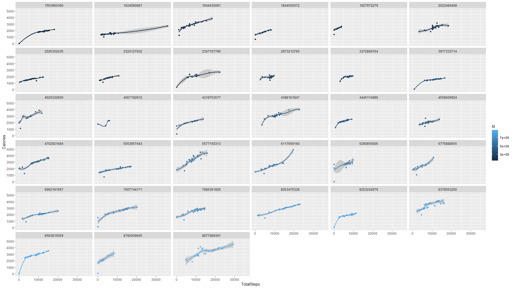

```{r setup, include=FALSE}
knitr::opts_chunk$set(echo = TRUE)
```


```{r echo=FALSE, out.width='20%',fig.align='center'}

```
  
## About the Company

Bellabeat is a high-tech company that manufactures health-focused smart products.Founded by Urška Sršen and Sando Mur, Bellabeat aims to empower women with knowledge about their own health and habits.
Website- <http://bellabeat.com>

## Ask
Sršen believes an analysis of Bellabeat’s available consumer data would reveal more opportunities for growth.Sršen asks you to analyze smart device usage data in order to gain insight into how consumers use non-Bellabeat smart devices. Using this information, she would like high-level recommendations for how these trends can inform Bellabeat marketing strategy.

## Business Task
To analyse smart device's usage data - uncover trends and patterns and to find how can bellabeat's marketing strategy be improved and how its customer's can benefit from it.

## Cleaning and Processing Data
Cleaning of the data was done using spreadsheets.The following operations were performed - 

* Removed Duplicate Rows  
* Removed whitespaces using trim function  
* Splitting Day_Date combined coloumns into separate Day and Date columns using split function
* Removed inconsistencies  

## Loading Packages
```{r , echo= TRUE, message=FALSE}
library(tidyverse)
library(lubridate)
library(ggplot2)
library(dplyr)
```
## Importing Datasets
```{r, message=FALSE}
activity<-read_csv('dailyActivity_merged.csv')
sleep<-read_csv('sleepDay_merged.csv')
weight<-read_csv('weightLogInfo_merged.csv')

```
## Viewing datsets
```{r}
View(activity)
View(sleep)
View(weight)
```
## Finding distinct observations in each dataset

* n_distinct(activity\$Id)    
* n_distinct(sleep\$Id)  
* n_distinct(weight\$Id)

In Activity -
```{r, echo=FALSE}
n_distinct(activity$Id)
```
In sleep -
```{r, echo=FALSE}
n_distinct(sleep$Id)
```
In weight -
```{r, echo=FALSE}
n_distinct(weight$Id)
```
## Summarizing datasets
#### Joining activity and sleep datasets by inner join
```{r}
activity_sleep= activity %>% inner_join(sleep,by=c('Id', 'Date'))
col1=c('Calories','TotalSteps','TotalMinutesAsleep')
summary(activity_sleep[col1])
summary(weight['WeightKg'])
```
**Important insights from the summaries**  

* Average Calories burnt: 2400  
* Average number of steps are 8500 per day. Recommended number are 10,000 steps/day. So this should be improved  
* Average number of hours slept by a person is 7  
* Average weight of a person is 72 kg. This can be reduced for a much healthier lifestyle.

## Visualizations 

Plotting a graph between distance/steps and calories burnt with color representing different people. Same color points represents the same person walking on different dates. Second graph shows separate plots for steps vs calories burnt for different people over time
```{r, message=FALSE}
  ggplot(data=activity, aes(x=TotalDistance,y=Calories,color=Id)) + geom_point()+  
  geom_smooth(method="gam")+xlab('Total Distance') +ylab('Calories Burnt')+  
  scale_color_gradientn(colours = rainbow(33))
```
  
***  

*ggplot(data=activity, aes(x=TotalSteps,y=Calories,color=Id)) + geom_point() + *  
*geom_smooth(method="loess")+ facet_wrap(~Id)*


**There is clear linear correlation between distance/steps and calories burnt. As the distance or number of steps increase - the more calories are burnt.**

***
```{r, message=FALSE}
  ggplot(data=activity_sleep,aes(x=TotalMinutesAsleep,y=SedentaryMinutes,color=Id))+  
  geom_point() +geom_smooth() + xlab('Minutes Asleep') +  
  ylab('Sedentary Minutes')+scale_color_gradientn(colours = rainbow(24))

```
  
* The above data shows as number of hours a person sleeps reduces, his sedentary time (non-active) time increases.One Plausibile reason could be that sleep replenishes our energy and reduces stress, thus making us more active.  
* The data shows an average of 500 minutes(8 hrs) results in least sedantary time, while sleeping less or oversleeping leads to increased sedantary time.  

***
```{r include=FALSE}

intensities=read_csv('hourlyIntensities_merged.csv')
intensities$ActivityHour=as.POSIXct(intensities$ActivityHour, format="%m/%d/%Y %I:%M:%S %p", tz=Sys.timezone())
intensities$time <- format(intensities$ActivityHour, format = "%H:%M:%S")
intensities$date <- format(intensities$ActivityHour, format = "%m/%d/%y")

int_new <- intensities %>%
  group_by(time) %>%
  drop_na() %>%
  summarise(mean_total_int = mean(TotalIntensity))

```

```{r}
  ggplot(data=int_new, aes(x=time, y=mean_total_int,, fill=mean_total_int)) +  
  geom_bar(stat = "identity")+theme(axis.text.x = element_text(angle = 90)) +   
  labs(title="Average Total Intensity vs. Time")

```
  
* The graph shows that people are most active between 7 am - 6 pm

## Recommendations  
* Bellabeat can give timely notifications to users on their step count and calories burnt. It can also give motivational texts or animations to urge people to walk and complete their daily goal. 

* It can give a reminder for sleep as well as track sleep to give more insights on the sleeping patterns of a user, thus making them more aware and conscious of their sleep schedule.

* It can also give a notification if their is an inactivity for an hour or more, reminding people to do light exercise or walk.

* Bellabeat app can also be used to inform people of good habits that lead to a healthier and happier lifestyle

Since Bellabeat is a women focused brand, the marketing team can focus on three major groups- 

* For older women, Bellabeat can be used to give timely alerts for their medicines or other daily activity.

* It can highlight the hectic and cumbersome life of working women or moms. Not giving time to their health because of work and children is very common. 

* For younger women or girls, mainly students, studying or sitting for long hours without much physical movement can lead to back pain and high cholesterol levels. Another point that can be highlighted is the excess use of electronic devices and its blue rays which negatively impacts the sleep quality.

Thus implementing the above mentioned recommendations can prove very useful to all three classes of women.
